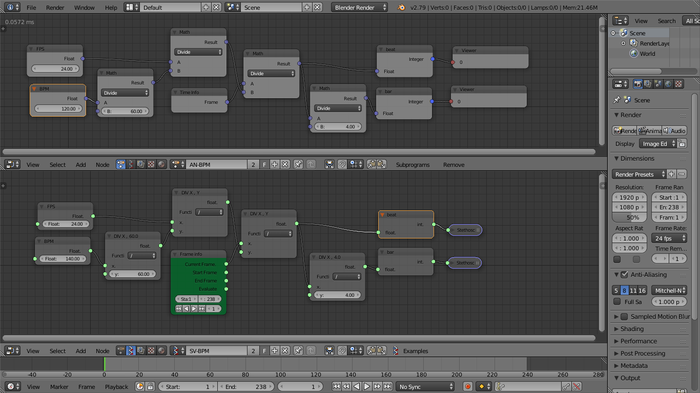

Description
===========

These are simple BPM abstractions for [Animation-nodes](https://github.com/JacquesLucke/animation_nodes) addon and [Sverchok](http://nikitron.cc.ua/sverchok_en.html) addon in Blender

Usage
=====

Simply enter your blender projects frame rate in the FPS node and choose which BPM you want to use
you can then use the values from the "beat" and "bar" nodes in your project or create your own tempo divisions, in this case one "bar" is four "beats"

you can either append the nodetrees from the blend file or create node groups or in the case of sverchok import the .json directly in a new nodetree.